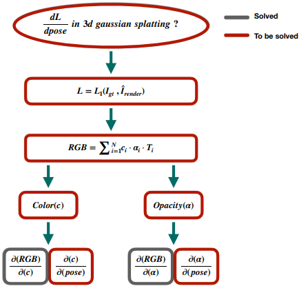
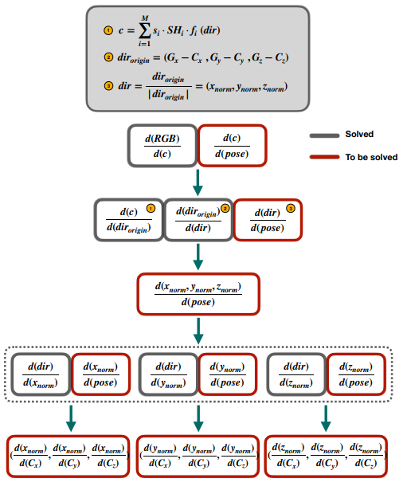
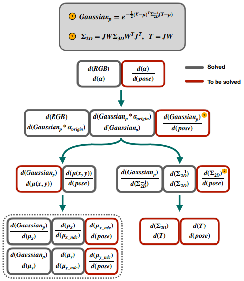

# Diff-gaussian-rasterization w.r.t camera pose (4×4 Transformation Matrix)
This is the official implementation of diff-gaussian-rasterization module in <a href="https://github.com/hjr37/CG-SLAM">CG-SLAM</a>.
# Derivation Framework
We have decomposed the entire pose derivation process from <strong>top to bottom</strong>, which is clearly visualized in the following figures. More detailed results will come soon!!!!
## Overview
<p align="center">
  
</p>

## Color Branch
<p align="center">
  
</p>

## Opacity Branch
<p align="center">
    
</p>

# Diff-gaussian-rasterization-Full
In this version, we convert the entire above derivation into a CUDA module. This version may be a bit redundant for the SLAM task, but we believe that this version should be exposed to more researchers to contribute to other 3D Gaussian topics.
## Installation
```bash
git clone https://github.com/hjr37/diff-gaussian-rasterization.git
cd diff-gaussian-rasterization-full
pip install .
```

## Running Code
<p style="text-align: justify;">This is the method to invoke our <strong>diff-gaussian-rasterization</strong> library.</p>

```python
render(viewpoint_cam, self.gaussians, self.pipe_hyper, self.background, viewmatrix=w2cT, fov=(self.half_tanfovx, self.half_tanfovy), HW=(self.H, self.W), gt_depth=gt_depth)
```
<p style="text-align: justify;">In our specially designed diff-gaussian-rasterization framework, we add a set of arguements: </p>

```
Args:
    --viewmatrix: Transformation matrix from the world coordinate to the camera coordinate.
    --fov: Field of view.
    --HW: Image height and width.
    --gt_depth: Ground truth depth map used for depth-related rasterization.
```

## Output
- The output of `GasussianRasterizer` is a <code>dict{}</code>:
```
    --'render': Rendered Color map.
    --'depth': Rendered Depth map.
    --'opacity_map': Rendered Silhouette map.
```

# Diff-gaussian-rasterization-Light
In our proposed <a href="https://github.com/hjr37/CG-SLAM">CG-SLAM</a>, due to efficiency, we adopted this light version, in which we ignored parts that have a minimal impact on the pose estimation. Specifically, we ignored the following two parts:

1. High-order SH coefficients (<strong>Color branch</strong>)

2. Projected 2D covariance in EWA Splatting (<strong>Blue boxes in Opacity branch</strong>)
## Installation
```bash
git clone https://github.com/hjr37/diff-gaussian-rasterization.git
cd diff-gaussian-rasterization-light
pip install .
```

## Running Code

<p style="text-align: justify;">This is the method to invoke our <strong>diff-gaussian-rasterization</strong> library.</p>

```python
render(viewpoint_cam, self.gaussians, self.pipe_hyper, self.background, viewmatrix=w2cT, fov=(self.half_tanfovx, self.half_tanfovy), HW=(self.H, self.W), gt_depth=gt_depth, track_off=True, map_off=False)
```
<p style="text-align: justify;">In our specially designed diff-gaussian-rasterization framework, we add a set of arguements: </p>

```
Args:
    --viewmatrix: Transformation matrix from the world coordinate to the camera coordinate.
    --fov: Field of view.
    --HW: Image height and width.
    --gt_depth: GGround truth depth map used for depth-related rasterization.
    --track_off: Flag to turn off the tracking component in the mapping process.
    --map_off: Flag to turn off the mapping component in the tracking process.
```
## Output

- The output of `GasussianRasterizer` is a <code>dict{}</code>:
```
    --'render': Rendered Color map.
    --'depth': Rendered Depth map.
    --'depth_median':  Depth map rendered by an alternative 'median strategy'.
    --'opacity_map': Rendered Silhouette map.
    --'depth_var': Rendered Uncertainty map (depth variance).
    --'gau_uncertainty': Uncertainty of the Gaussian primitives.
    --'num_related_pixels': Number of dominated pixels related to the Gaussian primitives.
```
# Citation
<pre><code>@article{hu2024cg,
    title={CG-SLAM: Efficient Dense RGB-D SLAM in a Consistent Uncertainty-aware 3D Gaussian Field},
    author={Hu, Jiarui and Chen, Xianhao and Feng, Boyin and Li, Guanglin and Yang, Liangjing and Bao, Hujun and Zhang, Guofeng and Cui, Zhaopeng},
    journal={arXiv preprint arXiv:2403.16095},
    year={2024}
}
