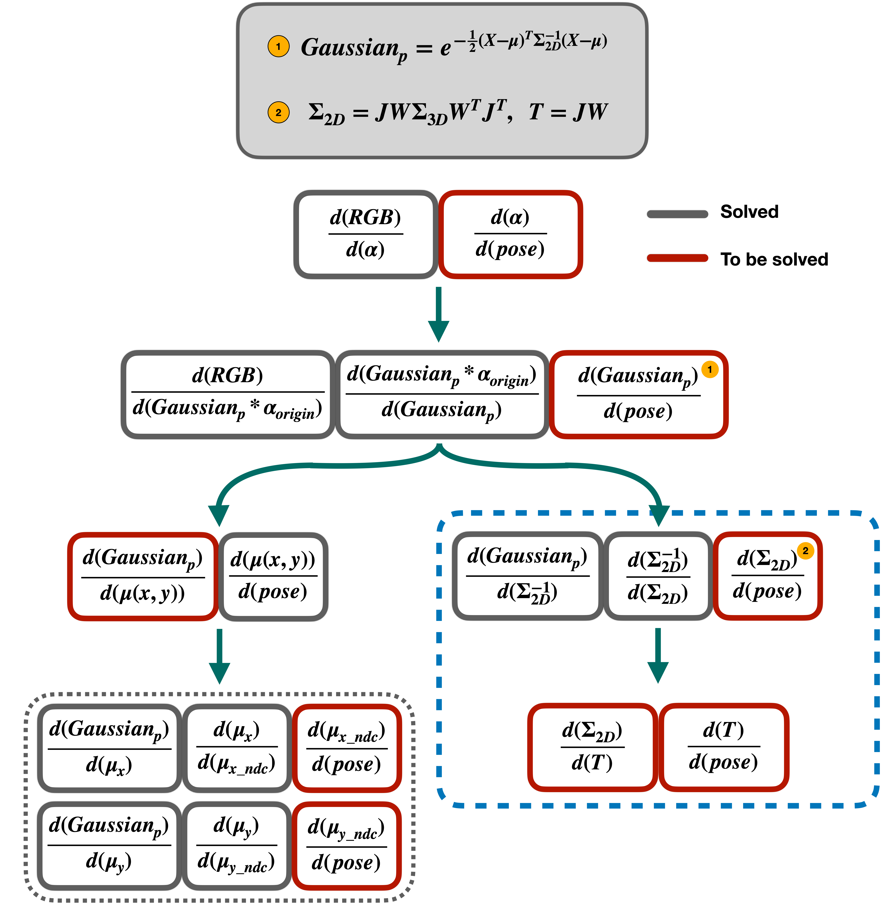

# Diff-gaussian-rasterization w.r.t camera pose (4×4 Transformation Matrix)
This is the official implementation of diff-gaussian-rasterization module in <a href="https://github.com/hjr37/CG-SLAM">CG-SLAM</a>.
# Derivation Framework
## Overview
  
  
## Color Branch
  
  
## Opacity Branch
    
</p>

# Diff-gaussian-rasterization-Full
## Input

<p style="text-align: justify;">The main components of Diff-Gaussian rasterization are <code>GaussianRasterizationSettings</code> and <code>GaussianRasterizer</code>. The <code>GaussianRasterizer</code> is employed with the objective of invoking a meticulously optimized C++/CUDA rasterization routine. It accomplishes this by utilizing the <code>GaussianRasterizationSettings</code> as input. The <code>GaussianRasterizationSettings</code> encapsulates the essential parameters and configurations required for the rasterization process, ensuring precise control and customization of the rendering output. </p>

- Class `GaussianRasterizer`

The input of GaussianRaseterizer is GaussianRaseterizationSettings

- Class `GaussianRasterizationSettings`

The input of GaussianRasterizationSettings includes:
```
    --image_height(int): The height of the rasterized image.
    --image_width (int): The width of the rasterized image.
    --tanfovx (float): The tangent of half the horizontal field of view angle.
    --tanfovy (float): The tangent of half the vertical field of view angle.
    --bg (torch.Tensor): The background image tensor.
    --scale_modifier (float): A scale modifier for the rasterization.
    --viewmatrix (torch.Tensor): The view matrix for the rasterization.
    --projmatrix (torch.Tensor): The projection matrix for the rasterization.
    --sh_degree (int): The spherical harmonics used for shading.
    --campos (torch.Tensor): The camera position for the rasterization.
    --prefiltered (bool): A flag indicating whether pre-filtering is enabled.
    --debug (bool): A flag indicating whether debug mode is enabled.
    --perspec_matrix (torch.Tensor): The perspective matrix for the rasterization.
    --track_off (bool): A flag indicating whether track mode is disabled.
    --map_off (bool): A flag indicating whether map mode is disabled.
```
this is an example of initialing GaussianRasterizationSettings
```python
raster_settings = GaussianRasterizationSettings(
    image_height=int(HW[0]),
    image_width=int(HW[1]),
    tanfovx=tanfovx,
    tanfovy=tanfovy,
    bg=bg_color,
    scale_modifier=scaling_modifier,
    viewmatrix=viewpoint_camera.world_view_transform,
    projmatrix=viewpoint_camera.full_proj_transform,
    sh_degree=pc.active_sh_degree,
    campos=viewpoint_camera.camera_center,
    prefiltered=False, 
    debug=False,
    perspec_matrix=viewpoint_camera.projection_matrix.T,
    track_off=track_off,
    map_off=map_off
)
```
## output
- The output of `GasussianRasterizer`:
```
    --color:
    --radii: 
    --depth: 
    --depth_median:
    --depth_var:
    --opacity_map: 
    --gau_uncertainty: 
    --gau_related_pixels:
```
## Gradients

## Running Code

# Diff-gaussian-rasterization-Light (Ignore )
