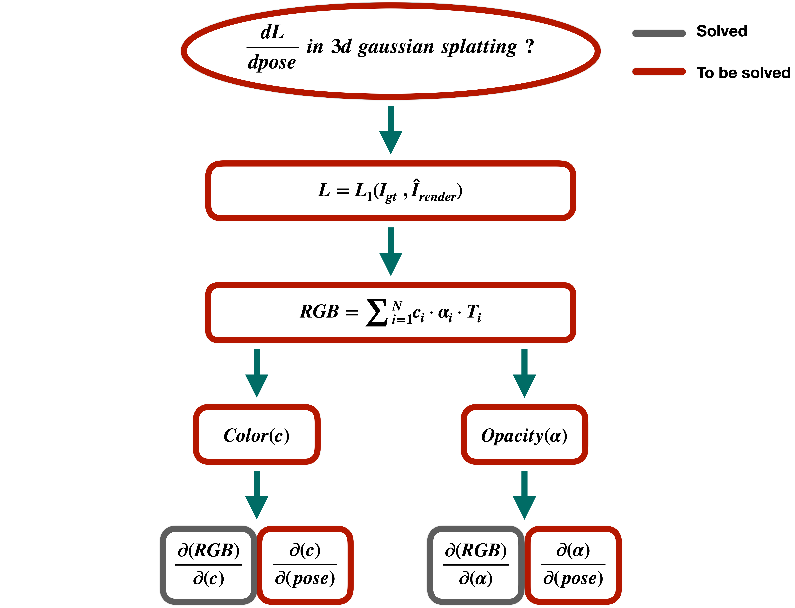

# Diff-gaussian-rasterization w.r.t camera pose (4×4 Transformation Matrix)
This is the official implementation of diff-gaussian-rasterization module in <a href="https://github.com/hjr37/CG-SLAM">CG-SLAM</a>.
# Derivation Framework
We have decomposed the entire pose derivation process from <strong>top to bottom</strong>, which is clearly visualized in the following figures. More detailed results will come soon!!!!
## Overview
<p align="center">
  
</p>

## Color Branch
<p align="center">
  
</p>

## Opacity Branch
<p align="center">
    
</p>

# Diff-gaussian-rasterization-Full
In this version, we convert the entire above derivation into a CUDA module. This version may be somewhat overqualified for the SLAM task, but we believe that this version should be exposed to more researchers to contribute to other 3D Gaussian topics.
## Installation
```bash
git clone https://github.com/hjr37/diff-gaussian-rasterization.git
cd diff-gaussian-rasterization-full
pip install .
```

## Running Code
<p style="text-align: justify;">This is the method to invoke our <strong>diff-gaussian-rasterization</strong> library.</p>

```python
render(viewpoint_cam, self.gaussians, self.pipe_hyper, self.background, viewmatrix=w2cT, fov=(self.half_tanfovx, self.half_tanfovy), HW=(self.H, self.W), gt_depth=gt_depth)
```
<p style="text-align: justify;">In our specially designed diff-gaussian-rasterization framework, we add a set of arguements: </p>

```
Args:
    --viewmatrix: View matrix used for transforming from world coordinate system to camera coordinate system, default is None.
    --fov: Field of view, default is None.
    --HW: Image height and width, default is None.
    --gt_depth: Ground truth depth map used for calculating depth-related metrics, default is None.
```

## Output
- The output of `GasussianRasterizer` is a <code>dict{}</code>:
```
    --'render': Rendered color image.
    --'viewspace_points': Points in the screen coordinate system.
    --'visibility_filter': A visibility filter indicating the visibility of Gaussian distributions.
    --'radii': Screen-space radii of the Gaussian distributions.
    --'depth': Rendered Depth map.
    --'opacity_map': Opacity map.
```

# Diff-gaussian-rasterization-Light (Ignore)
In our proposed <a href="https://github.com/hjr37/CG-SLAM">CG-SLAM</a>, due to efficiency, we adopted this light version, in which we ignored parts that have a minimal impact on the pose estimation. Missing parts in this version have been highlighted in blue boxes in the above images.
## Installation
```bash
git clone https://github.com/hjr37/diff-gaussian-rasterization.git
cd diff-gaussian-rasterization-full
pip install .
```

## Running Code

<p style="text-align: justify;">This is the method to invoke our <strong>diff-gaussian-rasterization</strong> library.</p>

```python
render(viewpoint_cam, self.gaussians, self.pipe_hyper, self.background, viewmatrix=w2cT, fov=(self.half_tanfovx, self.half_tanfovy), HW=(self.H, self.W), gt_depth=gt_depth, track_off=True, map_off=False)
```
<p style="text-align: justify;">In our specially designed diff-gaussian-rasterization framework, we add a set of arguements: </p>

```
Args:
    --viewmatrix: View matrix used for transforming from world coordinate system to camera coordinate system, default is None.
    --fov: Field of view, default is None.
    --HW: Image height and width, default is None.
    --gt_depth: Ground truth depth map used for calculating depth-related metrics, default is None.
    --track_off: Flag to turn off tracking mode, default is False.
    --map_off: Flag to turn off mapping mode, default is False.
    --tracking_mask_indices: Tracking mask indices used for controlling opacity, default is None.
```
## Output

- The output of `GasussianRasterizer` is a <code>dict{}</code>:
```
    --'render': Rendered color image.
    --'viewspace_points': Points in the screen coordinate system.
    --'visibility_filter': A visibility filter indicating the visibility of Gaussian distributions.
    --'radii': Screen-space radii of the Gaussian distributions.
    --'depth': Rendered Depth map.
    --'depth_median':  Depth map rendered using an alternative rendering strategy, as described in our research paper.
    --'opacity_map': Opacity map.
    --'depth_var': Depth variance map, as elaborated in our research paper.
    --'gau_uncertainty': Uncertainty of the Gaussian distributions.
    --'num_related_pixels': Number of pixels related to the Gaussian distributions.
```
